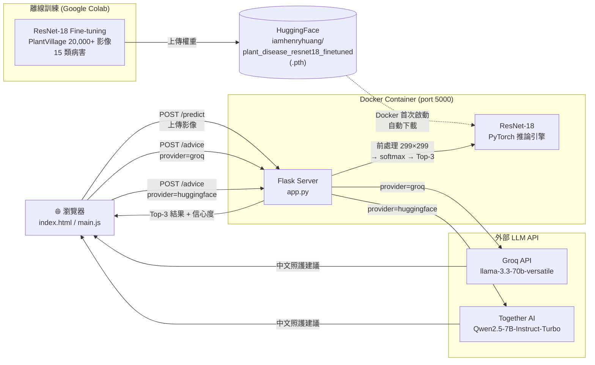

# 深度學習農作物病蟲害影像辨識
> **基於深度學習 ResNet-18 的即時影像辨識解決方案**

本專案利用 ResNet 遷移學習技術，實現高精度的自動化農作物病害檢測。透過兩階段訓練策略（凍結特徵提取層與全層微調），有效提升了模型在複雜病斑上的辨識能力。

## 訓練成果
本模型在驗證集上表現極其優異，尤其在第二階段 Fine-tuning 後取得了顯著突破：
- 初始驗證準確度：約 94% (僅訓練全連接層)
- 最終驗證準確度 (Fine-tuning)：**97.2%**
- 分類表現：模型對於 15 種常見作物病害（如蘋果黑星病、番茄晚疫病等）展現了極強的泛化能力，F1-score 穩定於高位。

## 技術規格
### 1. 訓練策略：兩階段遷移學習
為了達到最佳收斂效果，專案採用了以下步驟：
* 第一階段 (Transfer Learning)：凍結 ResNet-18 的卷積層，僅訓練輸出的 Linear Head。
* 第二階段 (Fine-tuning)：解凍模型參數，以極小的學習率進行全局微調，使模型能更精準地捕捉植物葉片的細微病變特徵，最終將 Accuracy 推升至 97% 以上。

### 2. 數據處理與模型架構
- 模型基礎：ResNet-18 (ImageNet Pre-trained)。
- 影像尺寸：輸入解析度調整為 `299x299`。
- 優化器配置：使用 Adam 優化器，搭配學習率衰減策略 (StepLR) 以確保細節微調時的穩定性。
- 數據集規模：[PlantVillage Dataset](https://www.kaggle.com/datasets/emmarex/plantdisease)，包含超過 20,000 張標註影像。

## 系統架構



---

## 核心功能
- 自動化分類：精準辨識包含黑斑病、銹病、白粉病等多種常見作物病害。
- 信心度回傳：輸出疾病類別並附帶信心程度，同時列出 Top-3 候選結果。
- 高效推理：ResNet-18 的輕量化特性，使其在邊緣設備端也能維持快速反應。
- LLM 照護建議：辨識完成後可選擇兩種 AI 後端產生中文照護建議：
  - **Groq**：呼叫 `llama-3.3-70b-versatile`，速度快、品質高。
  - **HuggingFace**：呼叫 `Qwen/Qwen2.5-7B-Instruct-Turbo`（透過 Together AI），繁中能力強。
- 三欄式介面：影像上傳、診斷結果、AI 建議並排顯示於同一面板，一目瞭然。

---

## 專案結構

```
2026-Spring-DTAI/
├── app.py                   # Flask 後端推論伺服器
├── pyproject.toml           # Python 依賴定義
├── uv.lock                  # 精確版本鎖定（由 uv lock 產生）
├── Dockerfile               # 容器化設定
├── docker-compose.yaml
├── .env                     # API 金鑰
├── templates/
│   └── index.html           # 前端網頁骨架
├── static/
│   ├── css/
│   │   └── main.css         # 樣式
│   └── js/
│       └── main.js          # 前端邏輯
└── train/
    ├── Train.ipynb          # 模型訓練流程
    └── plantvillage.ipynb   # 資料集探索
```

---

<details>
<summary>本地開發環境建置（不使用 Docker 時）</summary>

> 需要 Python 3.11 以上版本與 [uv](https://docs.astral.sh/uv/getting-started/installation/)。

```bash
# 安裝 uv（若尚未安裝）
# Windows (PowerShell)
powershell -ExecutionPolicy ByPass -c "irm https://astral.sh/uv/install.ps1 | iex"
# macOS / Linux
curl -LsSf https://astral.sh/uv/install.sh | sh

# 依照 uv.lock 精確安裝依賴並建立 .venv
uv sync

# 啟動虛擬環境後執行
# Windows (PowerShell)
.venv\Scripts\Activate.ps1
# macOS / Linux
source .venv/bin/activate

# 啟動開發伺服器
flask --app app run --debug

# 更新依賴後重新鎖定（僅在修改 pyproject.toml 後需要）
uv lock
```

</details>

---

## 啟動 Web 介面

本專案建議透過 Docker 啟動，容器首次執行時會自動從 HuggingFace 下載模型權重，無需手動準備。

```bash
docker compose up --build
```

啟動成功後，開啟瀏覽器前往 **http://localhost:5000** 即可使用。

---

## Docker 容器化部署

**前置條件：** 安裝 [Docker Desktop](https://www.docker.com/products/docker-desktop/)，並在專案根目錄建立 `.env` 檔案。

#### 建立 `.env` 檔案

在專案根目錄（與 `docker-compose.yaml` 同層）建立一個名為 `.env` 的純文字檔：

```env
# Groq（預設 LLM 後端）
# API Key 至 https://console.groq.com 免費申請
GROQ_API_KEY=your_groq_api_key_here

# 選填：指定 Groq 模型，預設為 llama-3.3-70b-versatile
# GROQ_MODEL=llama-3.3-70b-versatile

# HuggingFace（備用 LLM 後端，使用 Qwen）
# Token 至 https://huggingface.co/settings/tokens 申請
HF_TOKEN=your_huggingface_token_here

# 選填：指定 HF 模型與 provider，預設如下
# HF_MODEL=Qwen/Qwen2.5-7B-Instruct-Turbo
# HF_PROVIDER=together
```

> `.env` 已列入 `.gitignore`，不會被 commit 至版本控制。請勿將 API Key 直接寫入程式碼或 README。

| 動作 | 指令 |
|------|------|
| 首次啟動（自動 build，約 5–10 分鐘） | `docker compose up --build` |
| 日常啟動 | `docker compose up` |
| 背景執行 | `docker compose up -d` |
| 停止 | `Ctrl+C` 或 `docker compose down` |
| 完整清除（含 image，釋放約 1.1 GB） | `docker compose down --rmi all` |

啟動後開啟瀏覽器前往 **http://localhost:5000**。

---

### 可辨識的 15 種病害類別

| # | 類別 |
|---|------|
| 1 | Pepper Bell - Bacterial Spot（甜椒細菌性斑點病） |
| 2 | Pepper Bell - Healthy（甜椒健康） |
| 3 | Potato - Early Blight（馬鈴薯早疫病） |
| 4 | Potato - Late Blight（馬鈴薯晚疫病） |
| 5 | Potato - Healthy（馬鈴薯健康） |
| 6 | Tomato - Bacterial Spot（番茄細菌性斑點病） |
| 7 | Tomato - Early Blight（番茄早疫病） |
| 8 | Tomato - Late Blight（番茄晚疫病） |
| 9 | Tomato - Leaf Mold（番茄葉黴病） |
| 10 | Tomato - Septoria Leaf Spot（番茄斑枯病） |
| 11 | Tomato - Spider Mites（番茄二斑葉蟎） |
| 12 | Tomato - Target Spot（番茄靶斑病） |
| 13 | Tomato - Yellow Leaf Curl Virus（番茄黃化曲葉病毒） |
| 14 | Tomato - Mosaic Virus（番茄花葉病毒） |
| 15 | Tomato - Healthy（番茄健康） |

---

## 組員

| 系級 | 姓名 |
|------|------|
| 統計四 | 林承佑 |
| 統計四 | 曾博鴻 |
| 資訊三 | 黃柏淵 |
| 資訊三 | 陳立衡 |
| 資訊三 | 羅士恆 |
